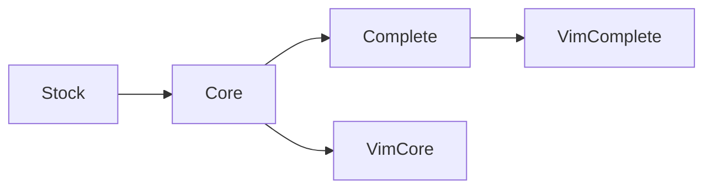

# VSCode Notetaking

Visual Studio Code has the components to make an outstanding note taking tool, but they're not integrated very well. This project aims to find a coherent whole.

## **TOO NEW**

This is just an experiment. Nothing is here yet. Nothing works.

## Launch a Profile

Might as well try it out. Choose which profile you'd like (probably _Complete_ or _VimComplete_, more below) and launch it. For example:

`./complete tmp`

TODO: walkthrough

## Profiles

* **Core**: the bare minimum that could be considered to be a good Markdown notetaking environment.
* **Complete**: Core plus additional functionality like math and diagrams.
* **VimCore**: Core, plus VSCodeVim installed. (mostly because VSCodeVim is popular and overrides a LOT of keybindings)
* **VimComplete**: Complete plus VSCodeVim
* **Stock**: an unmodified default VSCode install. Zero note taking functionality. Only interesting when trying to isolate a bug.

Or, graphically:

## Extensions

### Core

This attempts to provide a full-featured Markdown editing experience but no features unrelated to editing.

* Markdown Shortcuts
* Markdown TOC
* markdownlint

### Complete

This provides the editing experience of Core, plus features that are mature enough to be a part of every Markdown workflow.

* Markdown Emoji

### VimCore

Everything in Core, plus VSCodeVim.

### VimComplete

Everything in Complete, plus VSCodeVim.

### Stock

_(none)_

## License

The project respects the license of every component it uses. Where there's ambiguity, for example the files in this specific repository, it uses the MIT license.
